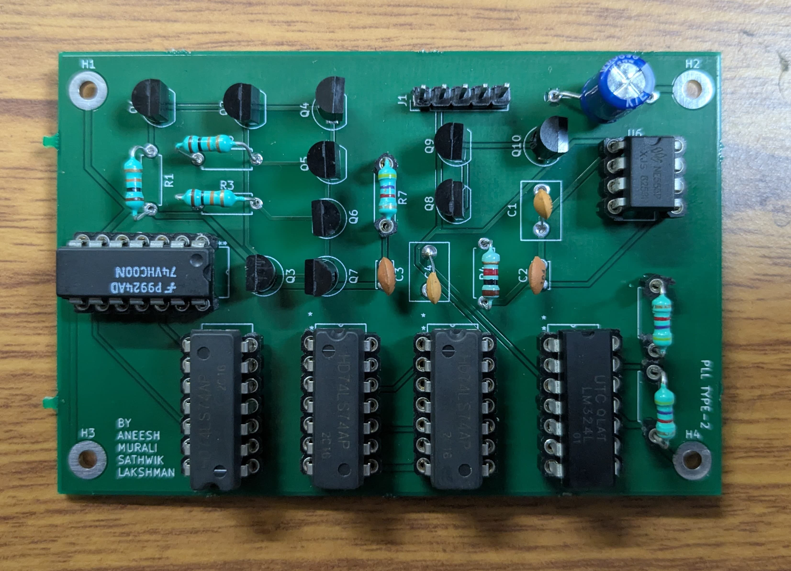

# PLL-Type2
<table>
  <tr>
    <td width="60%">
      
      
<b>Schematic</b>

    </td>
  </tr>
</table>

<table>
  <tr>
    <td width="50%">
      
      
<b>Layout</b>

    </td>
    <td width="50%">
      
      
<b>Layout - 3D View</b>

    </td>
  </tr>
</table>

<table>
  <tr>
    <td width="50%">
      
      
<b>PCB (Before Soldering)</b>

    </td>
    <td width="50%">
      
      
<b>Final PCB</b>

    </td>
  </tr>
</table>

Working video: https://www.youtube.com/watch?v=WpeVHUnthCc
